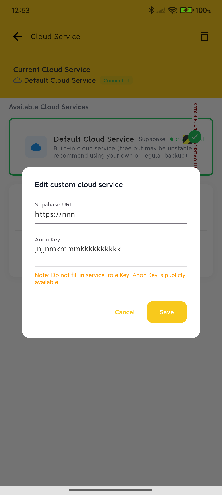

# BeeCount

> [中文](README_CN.md) | English

**Your Data, Your Control - Open Source Accounting App**

A lightweight, open-source, privacy-focused personal accounting app for iOS/Android. Features complete ledger management, category statistics, data analysis, import/export functionality, and customizable cloud backup. **Core Advantage: Support for custom Supabase backend, giving you complete control over your data.**

## 📱 Product Demo

### Core Features

<div align="center">
  
  
  
  
</div>

<div align="center">
  
  
  
  
</div>

### Advanced Features

<div align="center">
  
  
  
  
</div>

## 🌟 Key Features

### 🔒 Data Security & Privacy

- **Complete Autonomy**: Support for custom Supabase backend, data stored in your own project
- **Open & Transparent**: Fully open-source code, auditable logic, no black boxes
- **Offline First**: Based on local SQLite database, works without network connection
- **Optional Sync**: Cloud sync is an enhancement feature, works completely without external services

### 📊 Complete Accounting Features

- **Smart Accounting**: Support for income/expense categories, amounts, dates, notes, and complete information
- **Multi-Ledger Management**: Create multiple ledgers for different scenarios like personal, work, etc.
- **Category Statistics**: Automatically generate monthly income/expense reports, category rankings, trend analysis
- **Data Analysis**: Intuitive charts to help understand spending habits and financial status

### 🔄 Data Management

- **CSV Import/Export**: Support migration from other accounting apps or regular backups
- **Cloud Backup**: Optional upload to your own Supabase project for backup
- **Multi-Device Sync**: Configure same cloud service to sync data across multiple devices
- **Category Migration**: Support batch migration of transaction records to other categories

### 🎨 Personalization

- **Theme Customization**: Multiple theme colors available to create your personal interface style
- **Multi-Language Support**: Supports 8 language interface switching, covering major international languages
- **Flexible Configuration**: Adjust various usage preferences according to personal habits

### 🌍 Internationalization Support

- **Supported Languages**:
  - Simplified Chinese 🇨🇳
  - Traditional Chinese 🇨🇳
  - English 🇬🇧
  - 日本語 🇯🇵
  - 한국어 🇰🇷
  - Español 🇪🇸
  - Français 🇫🇷
  - Deutsch 🇩🇪
- **Language Features**:
  - Complete interface translation including all menus, buttons, and prompts
  - Smart category name translation and mapping
  - Localized date and number format display
  - Automatic recognition and matching of multi-language category names during CSV import
  - Support for system follow or manual language selection

> If you'd like to add support for a new language, welcome to create an issue or submit a PR directly!

## 🚀 Quick Start

### Option 1: Direct Installation (Recommended)

1. Go to the [Releases](https://github.com/FBSocial/BeeCount/releases) page
2. Download the latest `app-prod-release-*.apk` file
3. Install and start using (default local mode, no configuration needed)

### Option 2: Build from Source

```bash
# Clone the project
git clone https://github.com/FBSocial/BeeCount.git
cd BeeCount

# Install dependencies
flutter pub get
dart run build_runner build -d

# Run the app
flutter run --flavor dev -d android --dart-define-from-file=assets/config.json
```

## 📖 User Guide

### Basic Operations

- **Add Transaction**: Tap the "+" button at the bottom of the home screen
- **Edit Record**: Tap any transaction record to enter edit page
- **Delete Record**: Long press transaction record to select delete
- **Switch Months**: Tap the date at the top or scroll up/down in the list to flip pages
- **Hide Amounts**: Tap the eye icon in the top right of the home screen

### Data Management

- **Import Data**: Profile → Import Data → Select CSV file
- **Export Backup**: Profile → Export Data → Select export format
- **Category Management**: Profile → Category Management → Add/Edit/Delete categories
- **Ledger Switching**: Bottom navigation → Ledgers → Select or create new ledger

## ☁️ Cloud Backup Configuration (Optional)

### Why Choose Self-Hosted Cloud Service?

- **Data Sovereignty**: Data completely stored in your own Supabase project
- **Privacy Protection**: Developers cannot access any of your data
- **Cost Control**: Supabase free tier is sufficient for personal use
- **Stable & Reliable**: No dependency on third-party hosting services

### Configuration Steps

1. **Create Supabase Project**
   - Visit [supabase.com](https://supabase.com) to register an account
   - Create a new project, select appropriate region
   - Get URL and anon key from project settings

2. **Configure Storage**
   - Create a Storage Bucket named `beecount-backups` in Supabase console
   - Set as Private and configure RLS access policies

3. **App Configuration**
   - Open BeeCount → Profile → Cloud Service
   - Select "Custom Cloud Service"
   - Enter your Supabase URL and anon key
   - Login/register and start syncing

For detailed configuration guide, please refer to the project documentation.

## 🛠️ Development Guide

### Tech Stack

- **Flutter 3.27+**: Cross-platform UI framework
- **Riverpod**: State management solution
- **Drift (SQLite)**: Local database ORM
- **Supabase**: Cloud backup and sync service

### Project Structure

```
lib/
├── data/           # Data models and database operations
├── pages/          # Application pages
├── widgets/        # Reusable components
├── cloud/          # Cloud service integration
├── l10n/           # Internationalization resources
├── providers/      # Riverpod state providers
└── utils/          # Utility functions
```

### Development Commands

```bash
# Install dependencies
flutter pub get

# Code generation
dart run build_runner build --delete-conflicting-outputs

# Run tests
flutter test

# Build release version
flutter build apk --flavor prod --release
```

### Contribution Guidelines

1. Fork this project
2. Create feature branch (`git checkout -b feature/AmazingFeature`)
3. Commit changes (`git commit -m 'feat: add some feature'`)
4. Push to branch (`git push origin feature/AmazingFeature`)
5. Create Pull Request

**Commit Convention**: Use Chinese commit messages in format `type: brief description`
- `feat:` New feature
- `fix:` Bug fix
- `refactor:` Code refactoring
- `style:` Style adjustments
- `docs:` Documentation updates

## 📄 Open Source License

This project is open-sourced under the [MIT License](LICENSE). You are free to use, modify, and distribute.

## ⚠️ Disclaimer

- This software is provided "as is" without any express or implied warranties
- Users are responsible for any data loss or financial loss caused by using this software
- Please ensure legal and compliant use of this software

## 💬 FAQ

**Q: Can I use it normally without configuring cloud services?**
A: Absolutely! The app uses local storage by default, and all features work normally. You can still export CSV at any time.

**Q: Can I switch back to default mode after configuring custom cloud service?**
A: Yes, you can switch anytime. The saved custom configuration won't be lost and can be re-enabled.

**Q: How to ensure data security?**
A: We recommend using your own Supabase project, configuring proper access policies, regularly exporting CSV backups, using strong passwords and enabling two-factor authentication.

**Q: What data formats are supported?**
A: Currently supports CSV format for import/export, compatible with data formats from most mainstream accounting apps.

**Q: How to sync data across multiple devices?**
A: Configure the same Supabase URL and anon key on all devices, and log in with the same account for automatic sync.

---

## 🙏 Acknowledgments

Thanks to all friends who have contributed code, suggestions, and feedback to the BeeCount project!

If you have questions or suggestions, feel free to raise them in [Issues](https://github.com/FBSocial/BeeCount/issues) or participate in discussions at [Discussions](https://github.com/FBSocial/BeeCount/discussions).

**BeeCount 🐝 - Making Accounting Simple and Secure**