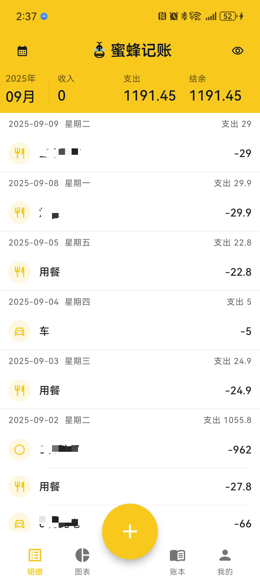
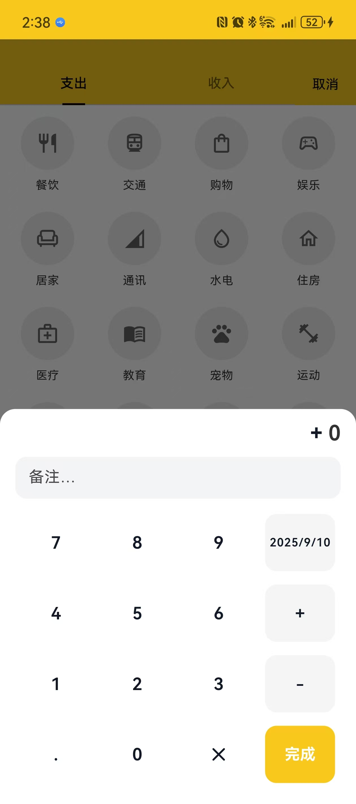
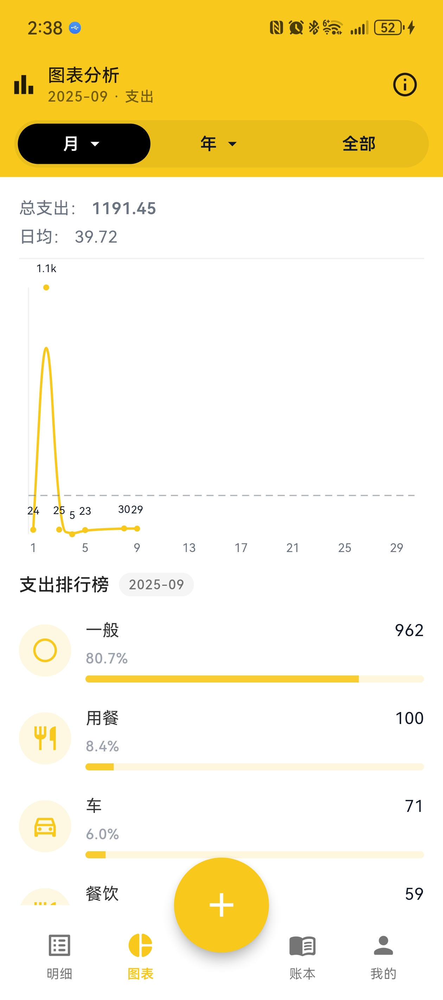
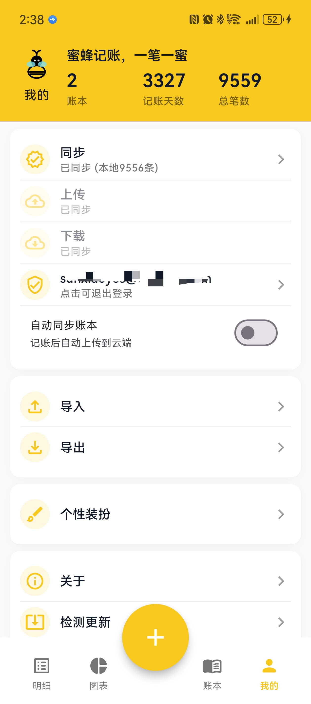

# 蜜蜂记账（BeeCount）

**你的数据，你做主的开源记账应用**

轻量、开源的个人记账 App，支持 iOS 与 Android。内置账本、分类、统计分析、导入导出功能。**最重要的是**：支持自定义 Supabase 后端，让你完全掌控自己的财务数据，无隐私担忧。

演示截图

<div align="center">
 
 
 
 
 
</div>

上述为部分功能页面截图，更多细节请体验 App。

## 核心亮点

### 🔒 数据安全，完全自主控制
- **你的数据，你做主**：支持自定义 Supabase 后端，数据存储在你自己的服务器
- **开源透明**：所有代码开源，数据处理逻辑完全可见，无隐私担忧
- **离线优先**：本地 SQLite 数据库，无网络也能正常使用
- **可选云同步**：需要时才连接云端，你决定何时何地备份数据

### 📱 功能特性
- **记账**：分类、金额、日期、备注，支持快速录入
- **分析**：月度收支、结余与分类排行，数据可视化
- **数据管理**：CSV 导入、导出，数据迁移无障碍  
- **云同步**：可选的云端备份/恢复，多设备数据同步
- **个性化**：主题色、图标自定义，打造专属记账体验

## 快速开始（用户）

前置要求

- Flutter 3.27+（fvm 可选）
- iOS/macOS 需 Xcode，Android 需 Android Studio/SDK

安装与运行

1) 安装依赖

```bash
flutter pub get
```

1) 运行（示例）

```bash
# Android 调试
flutter run --flavor dev -d android
# iOS 模拟器
flutter run -d ios
```

## 使用说明

### 基础操作
- **记账**：在首页底部"+"添加，支持长按记录删除
- **切换月份**：顶部日期选择器；到列表顶部/底部继续拉可切换月
- **隐藏金额**：首页右上角"眼睛"按钮
- **导入/导出**：我的页 → 导入/导出

### 云同步设置
1. **首次使用**：按照上述步骤创建自己的 Supabase 项目
2. **配置连接**：在应用中配置你的 Supabase URL 和密钥
3. **注册登录**：我的页 → 登录/注册，使用邮箱注册账号
4. **启用同步**：开启"自动同步"，记账后自动上传到你的云端

### 数据安全提醒
- ⚠️ **请使用你自己的 Supabase 项目**，不要使用他人提供的配置
- ✅ **定期导出备份**：建议每月导出 CSV 文件作为本地备份  
- 🔄 **多设备同步**：在其他设备上配置相同的 Supabase 项目即可同步数据

## 构建与发布

风味与命名

- Android flavors：dev（测试包）、prod（发布包）
- Debug 包：显示名“蜜蜂记账测试版”，可与 prod 共存
- Release 包：prodRelease，输出命名包含版本号，例如：`app-prod-release-v1.2.3(45).apk`

Android 打包

- Debug：

```bash
flutter build apk --flavor dev --debug
```

- Release：

1) 配置签名：复制 `android/key.properties.sample` 为 `android/key.properties` 并填写

2) 构建：

```bash
flutter build apk --flavor prod --release
```

iOS 打包

- 在 Xcode 中打开 `ios/Runner.xcworkspace`，按常规流程 Archive & Distribute

CI 与版本

- GitHub Actions 会根据标签创建 Release 并打包
- 应用内“关于”与“检测更新”会展示/获取最新版本

## 🛡️ 数据安全：自建云端服务

### 为什么选择自定义 Supabase？

与其他记账软件不同，蜜蜂记账让你完全掌控自己的财务数据：

- **数据主权**：财务数据存储在你自己的 Supabase 项目中，而非第三方服务器
- **隐私保护**：没有人能访问你的数据，包括开发者
- **服务稳定**：不依赖开发者提供的云服务，避免服务关闭风险
- **成本可控**：Supabase 提供慷慨的免费额度，足够个人使用

### 📋 自建步骤详解

#### 1. 创建 Supabase 项目

1. 访问 [supabase.com](https://supabase.com) 并注册账号
2. 点击"New Project"创建新项目
3. 选择区域（建议选择距离你最近的区域以获得最佳性能）
4. 设置数据库密码（请妥善保管）

#### 2. 获取项目配置

项目创建完成后，在项目设置页面获取：
- **URL**：形如 `https://your-project-id.supabase.co`
- **anon key**：公开密钥，用于客户端访问

#### 3. 配置应用

有两种方式配置你的 Supabase 连接：

**方式一：本地开发配置**
在项目根目录创建 `assets/config.json`：
```json
{
  "SUPABASE_URL": "https://your-project-id.supabase.co",
  "SUPABASE_ANON_KEY": "your-anon-key-here"
}
```

**方式二：编译时注入**
```bash
flutter run \
  --dart-define=SUPABASE_URL=https://your-project-id.supabase.co \
  --dart-define=SUPABASE_ANON_KEY=your-anon-key-here
```

#### 4. 数据表自动创建

首次登录时，应用会自动创建所需的数据表：
- `user_ledgers`：账本信息
- `user_transactions`：交易记录  
- `user_profiles`：用户配置

### 🔐 安全最佳实践

- ✅ **仅使用 anon key**：绝不在客户端使用 service_role key
- ✅ **启用 RLS**：Supabase 的行级安全策略确保用户只能访问自己的数据
- ✅ **定期备份**：虽然 Supabase 很稳定，但定期导出 CSV 备份是好习惯
- ✅ **密码安全**：使用强密码，启用双因素认证

### 💰 成本说明

Supabase 免费计划包含：
- 500MB 数据库存储
- 每月 2GB 传输量
- 50MB 文件存储

对于个人记账使用，免费额度绰绰有余。即使超出，付费计划也只需 $25/月起。

## 开发指南

主要技术

- Flutter + Riverpod + Drift(SQLite)
- 结构：`lib/pages` 页面、`lib/widgets` 组件、`lib/data` 数据层、`lib/cloud` 云服务

代码约定

- UI 颜色与间距：见 `lib/styles`
- Header：`lib/widgets/ui/primary_header.dart`
- 日志：`lib/utils/logger.dart`

常见脚本

- 依赖：flutter pub get
- 代码生成：dart run build_runner build -d

## 开源协议与免责声明

- 协议：本项目遵循 MIT License（见仓库 LICENSE）。
- 免责声明：

  - 本软件按“现状”提供，不对可用性或适配性作任何明示或暗示担保；
  - 使用本软件产生的任何数据丢失或损失风险由使用者自行承担；
  - 请遵守当地法律法规，不得用于任何违法用途。
