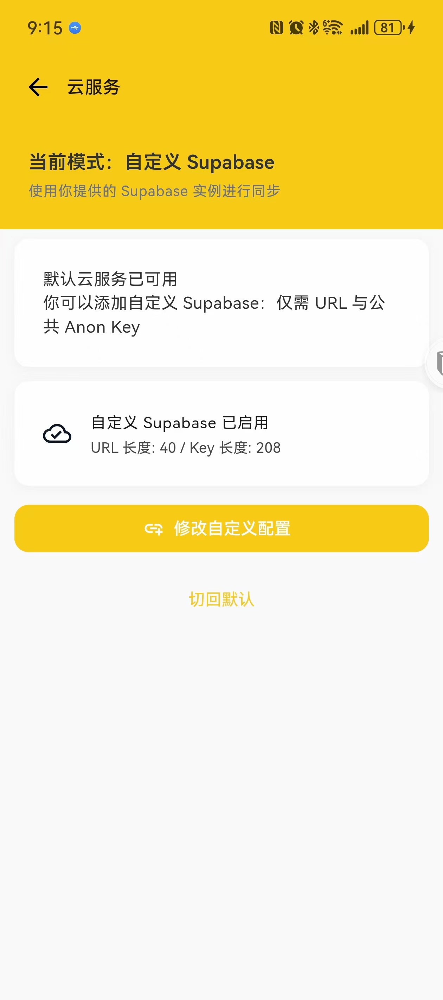

# 蜜蜂记账（BeeCount）

**你的数据，你做主的开源记账应用**

轻量、开源、隐私可控的个人记账 App（iOS / Android）。内置：账本、分类、统计分析、导入导出、可选云备份。**核心差异：支持自定义 Supabase 后端，数据完全由你掌控。**

<div align="center">
 
 
 
 
 
 
</div>

---

## 目录

0. TL;DR（一分钟了解差异 & 用法）
1. 核心亮点
2. 快速开始（普通用户：无需写代码）
3. 使用说明（日常操作）
4. 自建 Supabase 云端（可选进阶）
5. 构建与发布（仅需自行打包 / iOS 用）
6. 成本 & 安全最佳实践
7. 开发指南（贡献 / 二次开发）
8. 开源协议与免责声明

---

## 0. TL;DR

| 你是谁 | 推荐路径 | 是否需要 Supabase 账号 | 是否需要写代码 |
| ------ | -------- | ---------------------- | --------------- |
| 只想本地记账用户 | 直接安装 / 构建后使用，忽略“云服务” | 否 | 否 |
| 想备份/多设备同步 | 在 App 内“云服务”填入你自建的 Supabase URL/Key | 是 | 否（在官网点几下） |
| 想完全托管在自己 Supabase | 按第 4 节搭建 + App 内切换自定义 | 是 | 否 |
| 想二次开发或贡献代码 | 读第 7 节，clone 仓库运行 | 可选 | 是 |

最短上手（普通用户）：

1. 下载 Release 中最新 APK（或自行 `flutter build`）。
2. 直接使用（默认本地离线）。
3. 需要同步 → 第 4 节 10 分钟自建 Supabase → App 内“云服务”粘贴 URL / anon key → 登录 → 上传。

无需担心：不填 Supabase 仍可永久本地使用；云同步是可选增强，而不是强制注册。

---

## 1. 核心亮点

### 🔒 数据安全与自主

- 自定义 Supabase 后端：数据存你自己的项目
- 开源透明：逻辑可审计，无黑箱
- 离线优先：本地 SQLite；无网可记
- 可选同步：需要时才上传

### 📱 功能特性

- 记账：分类、金额、日期、备注，快速录入
- 分析：月度收支、结余、分类排行
- 数据：CSV 导入/导出
- 云备份：可选存储备份，多设备同步
- 个性化：主题色、图标

---

## 2. 快速开始（普通用户：无需写代码）

前置环境

- Flutter 3.27+（用于本地运行源码；直接安装 App 则不需要）
- iOS/macOS: Xcode；Android: Android Studio/SDK

使用方式有两种：

### A. 直接安装（最快）

到 Releases 下载最新 `app-prod-release-*.apk` 安装即可。（iOS 目前需自行打包或 TestFlight，见第 5 节）

### B. 自行运行源码（可调试）

克隆仓库后执行：

```bash
flutter pub get
# Android 调试
flutter run --flavor dev -d android
# iOS 模拟器
flutter run -d ios
```

---

## 3. 使用说明

基础操作

- 新增记账：首页底部 “+”
- 删除记录：长按条目
- 切换月份：顶部日期；滚动至列表首/尾继续拉可翻月
- 隐藏金额：首页右上角“眼睛”
- 导入/导出：我的 → 导入/导出 → 选择 CSV

云同步（默认模式）

- 可直接使用内置“默认云服务”（若启用）
- 或切换至“自定义 Supabase”（推荐，见下节）

数据安全建议

- 使用自己的 Supabase 项目
- 每月手动导出 CSV 备份
- 多设备：在另一设备填入相同 Supabase URL & anon key 即可同步

---

## 4. 自建 Supabase 云端（可选进阶）

### 4.1 为什么自建？

- 数据主权：无第三方介入
- 隐私：开发者不可访问
- 稳定：不依赖作者托管
- 成本：免费额度足够个人使用

### 4.2 创建项目

1. <https://supabase.com> 注册
2. New Project → 选区域 → 设数据库密码
3. 进入项目 Settings → 找到：

- URL: `https://your-project-id.supabase.co`
- anon key: 浏览器侧公开密钥（不要使用 service_role）

### 4.3 配置方式

方式一：assets/config.json

```json
{
  "SUPABASE_URL": "https://your-project-id.supabase.co",
  "SUPABASE_ANON_KEY": "your-anon-key-here"
}
```

方式二：运行时注入

```bash
flutter run \
  --dart-define=SUPABASE_URL=https://your-project-id.supabase.co \
  --dart-define=SUPABASE_ANON_KEY=your-anon-key-here
```

> 当前版本仅使用 Supabase **Storage** 存放备份文件（JSON / 压缩），无须手动创建数据库表（后续可能扩展）。

### 4.4 创建 Storage Bucket

1. Project → Storage → New Bucket
2. 名称：`beecount-backups`
3. 访问：推荐 Private
4. 启用后添加访问策略（见下）

文件命名（客户端自动）：

- `users/{user_id}/ledger_{ledgerId}.json` 或 `users/{user_id}/ledger_{ledgerId}.json.gz`

### 4.5 运行时切换自定义云服务

路径：我的 → 云服务  
操作：

- 填入 Supabase URL + anon key
- 登录 / 注册（邮箱）
- 首次启用：为每个账本执行一次“上传”初始化
- 可随时切回默认配置，原自定义设置会被保留

安全提示：不要使用 service_role key。

### 4.6 Storage 策略（RLS Policies）

目标：仅允许用户访问自己目录：`users/{auth.uid()}/...`

在 SQL Editor 中（或 Storage → Policies）依次创建策略（对象表：`storage.objects`）。确保 bucket 已创建且策略作用范围包含该 bucket。示例（PostgreSQL）：

SELECT / 读取

```sql
create policy "beecount_select_own"
on storage.objects for select
using (
  bucket_id = 'beecount-backups'
  and (storage.foldername(name))[1] = 'users'
  and (storage.foldername(name))[2] = auth.uid()::text
);
```

INSERT / 上传

```sql
create policy "beecount_insert_own"
on storage.objects for insert
with check (
  bucket_id = 'beecount-backups'
  and (storage.foldername(name))[1] = 'users'
  and (storage.foldername(name))[2] = auth.uid()::text
);
```

UPDATE

```sql
create policy "beecount_update_own"
on storage.objects for update
using (
  bucket_id = 'beecount-backups'
  and (storage.foldername(name))[1] = 'users'
  and (storage.foldername(name))[2] = auth.uid()::text
)
with check (
  bucket_id = 'beecount-backups'
  and (storage.foldername(name))[1] = 'users'
  and (storage.foldername(name))[2] = auth.uid()::text
);
```

DELETE

```sql
create policy "beecount_delete_own"
on storage.objects for delete
using (
  bucket_id = 'beecount-backups'
  and (storage.foldername(name))[1] = 'users'
  and (storage.foldername(name))[2] = auth.uid()::text
);
```

> 若 Bucket 设为 Private 必须有上述策略；否则客户端无法读写。

---

## 5. 构建与发布（需要自行打包 / iOS 安装时再看）

如果你只是 Android 普通用户并已下载 Release APK，可跳过此节。

风味

- Android flavors：dev（测试）、prod（发布）
- Debug 应用名：“蜜蜂记账测试版”
- Release 产物：`app-prod-release-vX.Y.Z(build).apk`

Android
Debug：

```bash
flutter build apk --flavor dev --debug
```

Release：

1. 复制 `android/key.properties.sample` → `android/key.properties` 并填写  
2. 构建：

```bash
flutter build apk --flavor prod --release
```

iOS

- 用 Xcode 打开 `ios/Runner.xcworkspace` → Archive → Distribute

CI

- GitHub Actions 依据标签自动打包并创建 Release
- 应用内“关于 / 检测更新”展示最新版本

---

## 6. 成本 & 安全最佳实践

安全建议

- 仅使用 anon key
- （未来若用数据库）开启 RLS 并编写策略
- 私有 Bucket + 严格策略
- 定期 CSV 线下备份
- 强密码 + 2FA

成本（Supabase 免费层示例）

- 500MB PostgreSQL
- 50MB 文件存储
- 2GB 流量/月  
个人记账足够；超出后付费层起步 $25/月。

---

## 7. 开发指南（贡献 / 二次开发）

主要技术

- Flutter + Riverpod + Drift (SQLite)
- 结构：`lib/pages`（页面）、`lib/widgets`（组件）、`lib/data`（数据层）、`lib/cloud`（云服务）、`lib/styles`（样式）

代码约定

- 颜色 / 间距：`lib/styles`
- Header：`lib/widgets/ui/primary_header.dart`
- 日志：`lib/utils/logger.dart`

常用命令

```bash
flutter pub get
dart run build_runner build -d
```

---

## 8. 开源协议与免责声明

- 协议：MIT（见 LICENSE）
- 免责声明：
  - 本软件按“现状”提供，不提供任何明示或暗示保证
  - 使用导致的数据丢失、经济损失由使用者自行承担
  - 请合法、合规使用

---

---

### FAQ（简短）

**Q: 不配置 Supabase 能一直用吗？** 可以，全部本地存储。你仍可随时导出 CSV。  
**Q: 自定义 Supabase 后能再切回默认吗？** 可以，且已保存的自定义配置不会丢失，可再次启用。  
**Q: 上传/下载失败？** 检查 anon key、Bucket 策略、网络或时间是否同步。  
**Q: 安全性？** 仅使用 anon key，Storage 目录隔离到 `users/{uid}`，策略限制跨用户访问。  

---

欢迎提交 Issue / PR 改进功能与策略示例。  
如有建议可在仓库讨论区提出。  
感谢使用 蜜蜂记账 🐝
